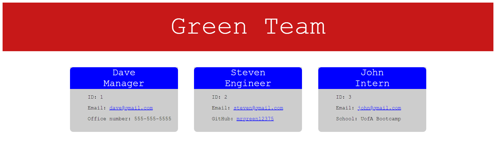

# green-team-generator

## Description
This project is to create a team profile generator that populate through html. To do so I had to create a node.js application takes in the teams profile information through prompts and generates an html webpage. I created test files, class files, and js files. to use the test files I wrote code that should verify the class information and installed jest. For the index.js file I created objects for the prompt quetions and made an index.html for the answers to be generated to. The team profile shows manager, engineer, and inter information. The manager information shows name, id, email, and office number. The engineer information shows name, id, email, and github. The intern information shows name, id, email, and school information.
## Table of contents
- [Mock-up](#Mock-up)
- [Installation](#Installation)
- [Usage](#Usage)
- [Contribution](#Contributing)
- [Test](#Test)
- [Questions](#Questions)
- [Diployment Links](#Questions)
## Mock-up

## Installation
npm install

inquirer

jest
## Usage
node index.js
## Contributing
Steven Green
## Test
npm run test
## Questions
GitHub Username: [mrgreen12375](https://github.com/mrgreen12375)

Email Address: [ste2144105@gmail.com](ste2144105@gmail.com)
## Deployment Links
Screencastify: https://drive.google.com/file/d/1dlw3_pU60sS7NXjp5brb5RcdLK49NlAD/view

GitHub Repo: https://github.com/mrgreen12375/green-team-generator